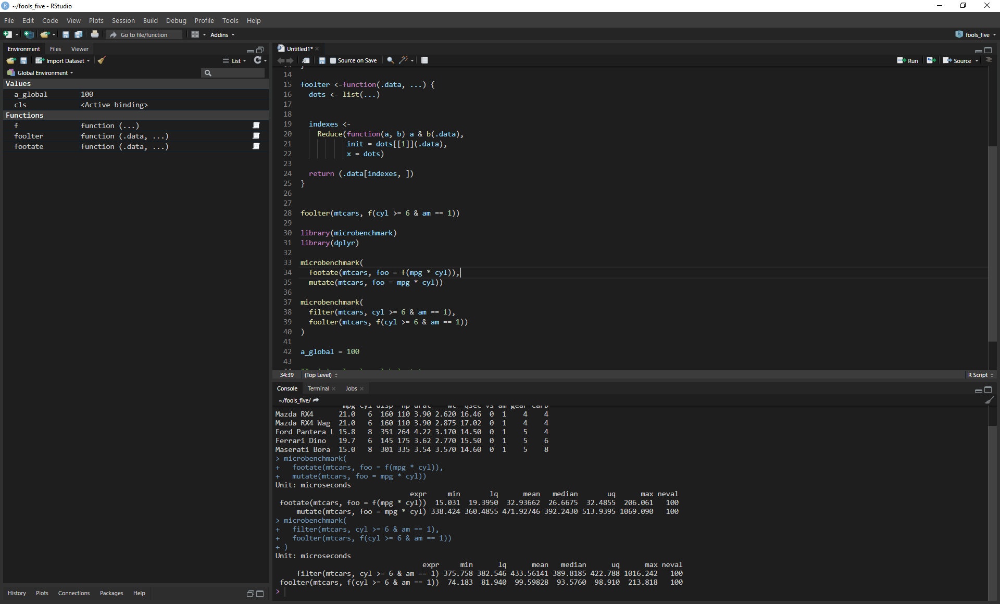

<!-- README.md is generated from README.Rmd. Please edit that file -->

```{r, include = FALSE}
knitr::opts_chunk$set(
  collapse = TRUE,
  comment = "#>",
  fig.path = "man/figures/README-",
  out.width = "100%"
)
```

# rscodeiop

An enhanced RStudio theme inspired by Visual Studio Code - updated and improved version by pefrens.

<!-- badges: start -->
[](https://lifecycle.r-lib.org/articles/stages.html#experimental)
[](https://github.com/pefrens/rscodeiop/actions/workflows/R-CMD-check.yaml)
<!-- badges: end -->

## Overview

`rscodeiop` is an improved and updated version of the popular `rscodeio` theme, bringing Visual Studio Code's sleek dark interface to RStudio. This package includes enhanced functionality, better error handling, and improved user experience while maintaining the beautiful VS Code-inspired aesthetics.

### Key Improvements in rscodeiop

- **Enhanced error handling** and validation
- **Improved installation process** with better feedback
- **Status checking functions** to monitor theme state
- **Safer file operations** with automatic backups
- **Cross-platform compatibility** improvements
- **Comprehensive documentation** and examples

<p align="center">
  
</p>

## Installation

You can install the development version of `rscodeiop` from [GitHub](https://github.com/pefrens/rscodeiop) with:

```r
# Using pak (recommended)
pak::pak("pefrens/rscodeiop")

# Or using remotes
# install.packages("remotes")
# remotes::install_github("pefrens/rscodeiop")
```

## Prerequisites

- **RStudio 1.2.0 or higher** (required for theme support)
- **Administrator privileges** for menu theme installation (Windows/Linux only)

### Important Note About Permissions

`rscodeiop` modifies RStudio's menu themes by updating style sheets in the RStudio installation directory. This requires administrator privileges:

**Windows:**
- Right-click on RStudio shortcut or menu icon
- Select **"Run as Administrator"**

**Linux:**
- Start RStudio from terminal: `sudo rstudio --no-sandbox`

**macOS:**
- No administrator privileges required
- Menu theming is not supported (inherits from macOS system theme)

## Quick Start

### Basic Installation

```r
# Install theme with menu styling (requires admin privileges)
rscodeiop::install_theme()

# Install theme without menu styling (no admin privileges needed)
rscodeiop::install_theme(menus = FALSE)
```

### Check Installation Status

```r
# Get detailed status information
rscodeiop::print_theme_status()

# Check if theme is installed
rscodeiop::rscodeio_installed()

# Check if menu theme is active
rscodeiop::is_menu_theme_active()
```

## Advanced Usage

### Force Reinstallation

```r
# Reinstall even if already present
rscodeiop::install_theme(force = TRUE)
```

### Menu Theme Management

```r
# Activate menu theme separately
rscodeiop::activate_menu_theme()

# Deactivate menu theme (restores original RStudio menus)
rscodeiop::deactivate_menu_theme()

# Silent operations (no console messages)
rscodeiop::activate_menu_theme(silent = TRUE)
rscodeiop::deactivate_menu_theme(silent = TRUE)
```

### Complete Uninstallation

```r
# Remove all rscodeiop themes and restore original menus
rscodeiop::uninstall_theme()
```

## Recommended RStudio Settings

For the best visual experience, enable these RStudio settings:

1. **Tools** → **Global Options…** → **Code** → **Display**:
   - ☑ **Highlight selected line**
   - ☑ **Show indent guides**
   - ☑ **Show syntax highlighting in console input**
   - ☑ **Highlight R function calls**

2. **Tools** → **Global Options…** → **Appearance**:
   - Select **rscodeiop** or **tomorrow night bright (rscodeio)** theme

## Theme Management

### Switching Themes

The menu theme persists even when switching to other RStudio themes. To manage this:

```r
# Before switching to another theme, deactivate menu theme
rscodeiop::deactivate_menu_theme()

# Switch to desired theme in RStudio UI
# Tools → Global Options → Appearance → Editor theme

# Reactivate rscodeiop menu theme if desired
rscodeiop::activate_menu_theme()
```

### Troubleshooting

If you encounter issues:

```r
# Check current status
rscodeiop::print_theme_status()

# Force clean reinstall
rscodeiop::uninstall_theme()
rscodeiop::install_theme(force = TRUE)

# Install without menu themes if permission issues persist
rscodeiop::install_theme(menus = FALSE)
```

## Platform Support

`rscodeiop` has been tested on:

- ✅ **Windows 10/11** (with RStudio Desktop)
- ✅ **Ubuntu/Pop!_OS Linux** (with RStudio Desktop)
- ✅ **macOS** (editor themes only, menu themes not supported)
- ⚠️ **RStudio Server** (editor themes only, menu themes not supported)

## What's Included

### Editor Themes
- **rscodeiop** - Main dark theme inspired by VS Code
- **tomorrow night bright (rscodeio)** - Alternative bright variant

### Menu Themes (Windows/Linux only)
- Dark menu bars and dialogs
- Consistent VS Code-inspired styling
- Automatic backup and restoration

## Contributing

Issues and pull requests are welcome! Please visit the [GitHub repository](https://github.com/pefrens/rscodeiop).

### Reporting Issues

When reporting issues, please include:

```r
# Run this and include the output
rscodeiop::print_theme_status()
sessionInfo()
```

## Credits

This package is an enhanced version of the original [`rscodeio`](https://github.com/anthonynorth/rscodeio) by Anthony North. Special thanks to the original author for creating the beautiful VS Code-inspired theme foundation.

**Improvements by:** [pefrens](https://github.com/pefrens)

## License

This project maintains the same license as the original `rscodeio` package.

---

*Note: After installation with menu themes, restart RStudio normally (without administrator privileges) to see the full theme applied.*
